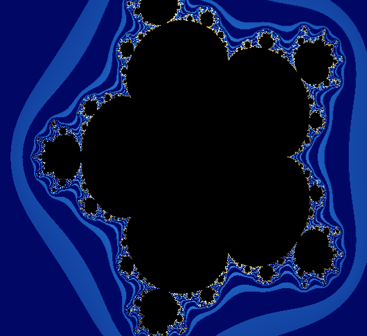
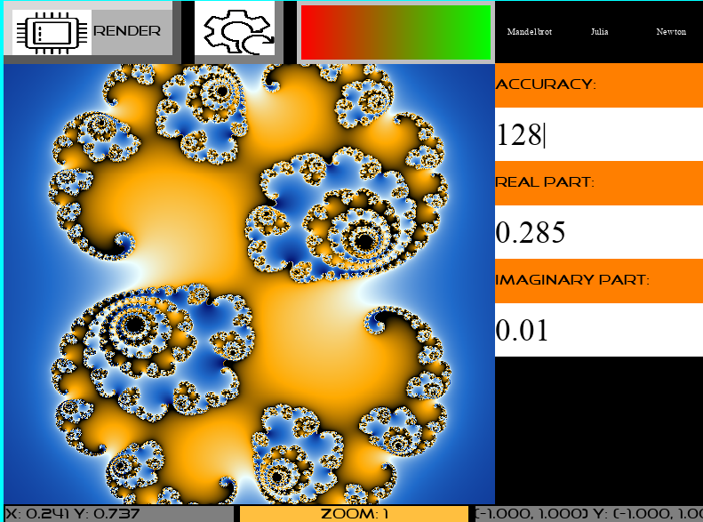
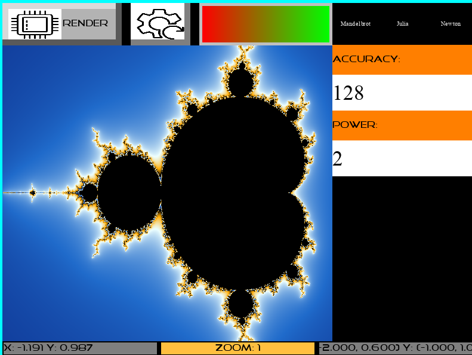
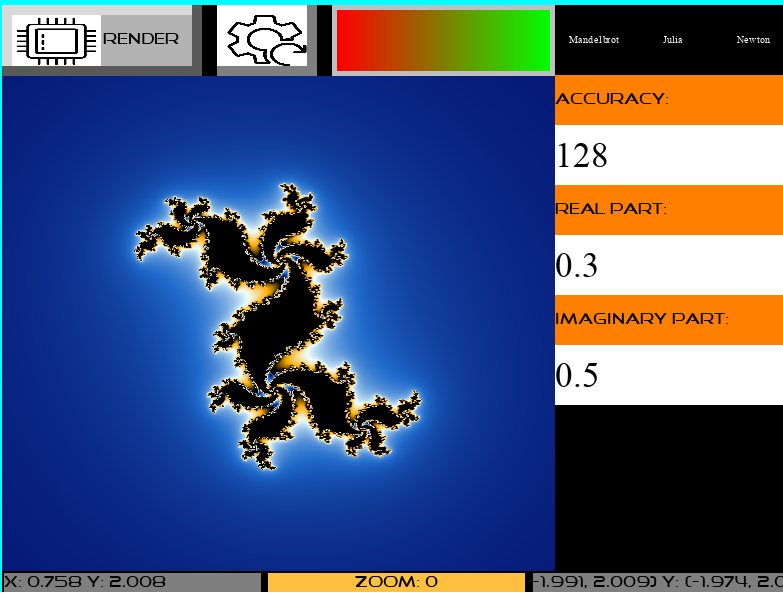
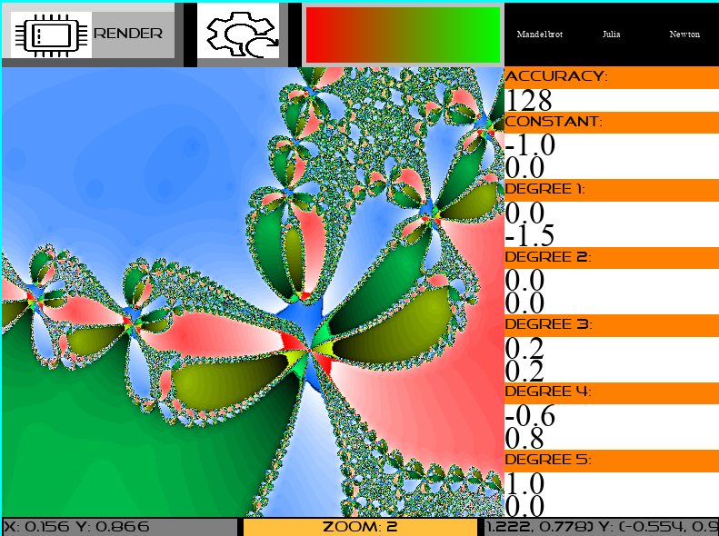

# fractsim
Awesome fractals generation program, which is faster than anything existing at the moment and much more configurable. That being said it does draw fractals of multiple types with some sort of efficiency and a nice coloring.

# Installation

- Clone the repo: `git clone git@github.com:Knoblauchpilze/fractsim.git`.
- Clone dependencies:
    * [core_utils](https://github.com/Knoblauchpilze/core_utils)
    * [maths_utils](https://github.com/Knoblauchpilze/maths_utils)
    * [sdl_engine](https://github.com/Knoblauchpilze/sdl_engine)
    * [sdl_core](https://github.com/Knoblauchpilze/sdl_core)
    * [sdl_graphic](https://github.com/Knoblauchpilze/sdl_graphic)
    * [sdl_app_core](https://github.com/Knoblauchpilze/sdl_app_core)
- Go to the project's directory `cd ~/path/to/the/repo`.
- Compile: `make r`.
- Install: `make install`.

Don't forget to add `/usr/local/lib` to your `LD_LIBRARY_PATH` to be able to load shared libraries at runtime.

# Usage

The application is based on a `SDL` engine allowing to render fractal on the CPU with a threaded mechanism. Several kind of fractals are handled:
 * Mandelbrot set
 * Julia set
 * Newton polynomial fractal

Each type of fractal is accessible through a dedicated configuration panel and is displayed in the main rendering window. Each fractal type has its own customization possibilities.
The user can pan in the rendering window which will trigger a rendering of the missing tiles while the already computed ones are kept in memory. This allows to fully explore a given zoom level. Each time the user zooms in or out with the mouse wheel a zoom operation is performed where the viewing window's dimensions are divided/multiplied by `2`. An automatic recomputation of the fractal is triggered at these occasions. The user can reset to the initial viewing distance for this fractal type at any time.

# Features

The application allows to explore the different fractals until decent zoom levels and with an acceptable rendering speed. Each fractal type has its own control panel, described below.
Note that changing any control while the fractal is zoomed in will reset the viewing window.

## Mandelbrot set

The canonical mandelbrot set can be represented using this fractal type. The exponent to apply to the `z^n+c` can be defined along with the accuracy. The deeper one wants to zoom inside the set the larger this value has to be to account for very slowly diverging points.

## Julia set

A large family of Julia sets can be rendered using this fractal type. The value of the `c` constant in the series can be specified through the controls, along with the accuracy. Similar behavior is provided to the Mandelbrot set.

## Newton polynomial fractal

A family of fractal rising from the zeroes of a polynomial. Each area will be applied a series as described in the article here (https://en.wikipedia.org/wiki/Newton_fractal) where some zeroes define regions where the series will converge to a certain value.
This fractal type takes slightly more time to compute given all the derivatives and evaluation to perform and also has a slightly less appealing palette but it's still interesting to play with.
